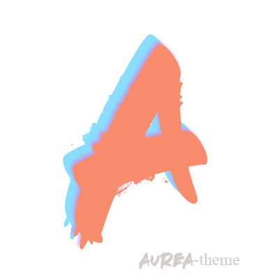
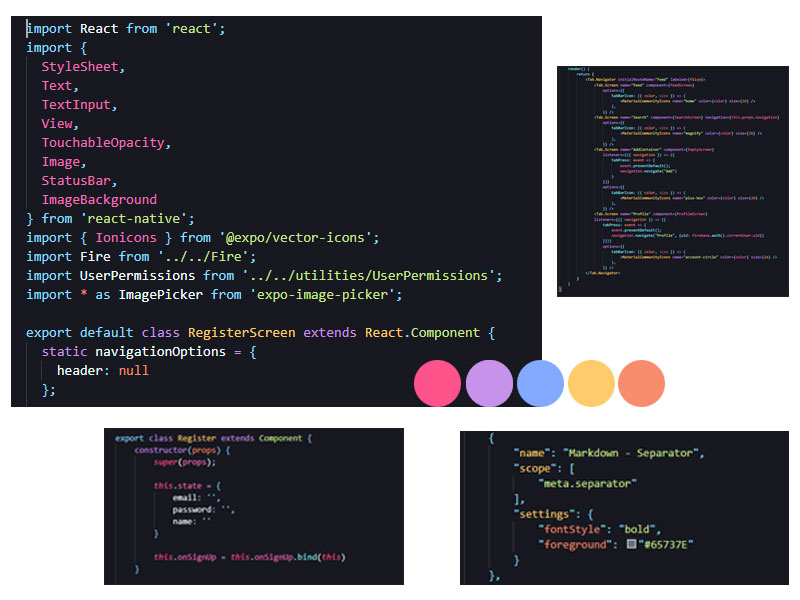

# Aurea
## This is the README for your extension "aurea"
A beautiful dark theme with beautiful colors for visual studio code, for use by all audiences. Enjoy it!

## Installation
* Copy extension with npm command
* Make the magic happen
* Open the command palette with Ctrl + Shift + Po⇧⌘P
* Select Preferences: Color Theme and choose a variant of Aurea.

### For more information
* [Support & SMS](https://www.linkedin.com/in/andre-min%C3%ADn-2020happy/)
* [Markdown Syntax Reference](https://help.github.com/articles/markdown-basics/)

**Enjoy!**
